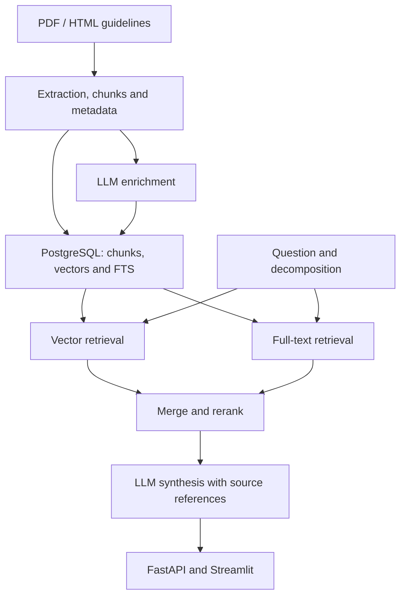

# Evidentum

**AI-powered clinical evidence assistant for searching, comparing, and synthesizing clinical guidelines.**

Evidentum is a hackathon-born RAG prototype for navigating Russian and international clinical recommendations. It combines document ingestion, hybrid retrieval and LLM synthesis, with source excerpts and references exposed alongside the answer. The team **won 3rd place at the hackathon**.

**Python · FastAPI · PostgreSQL · pgvector · SQLAlchemy · Alembic · Streamlit · Docker · Nginx · RAG · Hybrid Search · Yandex Cloud · OpenAI · Anthropic**

Published as a portfolio and research artifact. See [ARCHITECTURE.md](ARCHITECTURE.md) for implementation details and [PROMPTS.md](PROMPTS.md) for prompt design.

> Research and demonstration prototype, not a validated clinical decision support system. Generated answers may contain errors and must be checked against original sources. Do not use it as a substitute for professional clinical judgment.

## What it does

- Ingests PDF and HTML documents, extracts text, and creates chunks with source metadata.
- Generates Yandex embeddings and stores them in PostgreSQL with `pgvector`.
- Combines vector similarity with PostgreSQL full-text search.
- Decomposes complex questions and reranks results using multiple retrieval signals.
- Answers questions and compares guidelines with structured synthesis and source references.
- Enriches documents with summaries and clinical metadata through LLM calls.
- Provides a FastAPI API, a Streamlit UI, query logs, feedback and an LLM-based evaluation module.
- Abstracts text-generation providers: Yandex, OpenAI and optional Anthropic.

Source references improve traceability; they do not prove that a generated claim is correct. Reranking uses application scoring logic, rather than a separately trained cross-encoder.

## Architecture



Embeddings currently use **Yandex Cloud independently of the text-generation provider**. Switching `LLM_PROVIDER` to OpenAI or Anthropic does not remove this dependency. The original bilingual retrieval defaults also use Yandex translation.

## Local quick start

Requires Docker Engine with Docker Compose v2. The default setup exposes the database, API and UI on loopback interfaces and creates its own bridge network.

1. Clone the repository and create your local configuration:

   ```bash
   git clone https://github.com/glazole/evidentum.git
   cd evidentum
   cp .env.example .env
   ```

2. Generate local database and admin secrets without printing them:

   ```bash
   python - <<'PY'
   from pathlib import Path
   import secrets

   path = Path('.env')
   lines = path.read_text().splitlines()
   for key in ('POSTGRES_PASSWORD', 'ADMIN_API_TOKEN'):
       lines = [f'{key}={secrets.token_urlsafe(32)}' if line == f'{key}=' else line
                for line in lines]
   path.write_text('\n'.join(lines) + '\n')
   PY
   ```

   Set `YANDEX_FOLDER_ID` and `YANDEX_API_KEY` in `.env`. Add the selected text-generation provider's credentials if using OpenAI or Anthropic. Leave unused keys empty. Provider calls can incur charges.

3. Start the application:

   ```bash
   docker compose config --quiet
   docker compose up -d --build
   docker compose exec api alembic current
   curl http://localhost:8000/api/health
   ```

   - UI: http://localhost:7860
   - API documentation: http://localhost:8000/docs
   - API health: http://localhost:8000/api/health

   Alembic migrations run automatically before the API starts. The initial database is empty. The API also scans `data/raw` for documents on startup and can automatically ingest, embed and enrich them.

4. Upload a permitted PDF/HTML document through the UI, or copy it to `data/raw` and ingest it through the CLI:

   ```bash
   docker compose exec app python -m app.services.ingest --file data/raw/your_file.pdf
   docker compose exec app python -m app.services.embedder --list-documents
   docker compose exec app python -m app.services.embedder --document-id <DOCUMENT_ID>
   ```

   Use the actual ID from the document list; it is not always `1`. On a clean startup, do not run a second CLI ingestion while the startup scanner is processing the same corpus.

5. Query the prepared corpus through the UI or CLI:

   ```bash
   docker compose exec app python -m app.services.retriever \
     'антикоагулянтная терапия при фибрилляции предсердий' \
     --translate-mode dual_query --top-k 8
   ```

## Configuration

[.env.example](.env.example) contains local defaults and blank credential fields. `.env` is ignored by Git and excluded from Docker image builds; Compose supplies it at runtime.

| Setting | Purpose |
| --- | --- |
| `POSTGRES_DB`, `POSTGRES_USER`, `POSTGRES_PASSWORD` | Compose database settings; preserves the original local defaults; custom passwords must be URL-safe |
| `ADMIN_API_TOKEN` | Token required by administrative endpoints |
| `UI_ADMIN_API_TOKEN` | Optional UI override; otherwise the UI uses `ADMIN_API_TOKEN` |
| `YANDEX_FOLDER_ID`, `YANDEX_API_KEY` | Embeddings and default Yandex text generation |
| `LLM_PROVIDER` | `yandex`, `openai` or `anthropic` for text generation |
| `OPENAI_API_KEY`, `ANTHROPIC_API_KEY` | Credentials for alternative text-generation providers |
| `CORS_ALLOW_ORIGINS` | Allowed browser origins |
| `DATA_RAW_DIR`, `UPLOAD_MAX_BYTES` | Upload directory and file-size limit; default limit is 25 MiB |
| `RETRIEVER_MODE` | `hybrid` combines vector retrieval and PostgreSQL FTS |
| `RETRIEVER_QUERY_DECOMPOSITION` | Enables question decomposition |
| `RETRIEVER_TRANSLATE_MODE`, `ANSWER_TRANSLATE_MODE` | `dual_query` preserves the original bilingual retrieval mode |

When `ADMIN_API_TOKEN` is empty, administrative endpoints return `503`. It does not provide general user authentication or isolate query logs between users.

Anthropic requires installing its optional SDK: uncomment `anthropic>=0.30` in `requirements.txt` and rebuild. Model aliases and default model IDs live in `app/services/llm.py`; check that the chosen model is available for your provider account.

For CLI use outside Docker, explicitly set `DATABASE_URL` and export the required environment variables. The application does not automatically load `.env` outside Compose.

## Optional proxy setup

```bash
docker compose -f docker-compose-full.yml config --quiet
docker compose -f docker-compose-full.yml up -d --build
```

This alternative preserves the original nginx HTTPS, Redis and Certbot arrangement. Set `DOMAIN` in `.env` and provision certificates before starting nginx; its renewal service does not issue the first certificate. The nginx image renders `nginx/templates/default.conf.template` using `DOMAIN`. Only that variable is substituted; nginx request variables remain intact.

Use one Compose variant at a time; they reuse container and volume names. Redis remains in the original full deployment file; application code currently does not consume it. See [deploy/examples](deploy/examples/README.md) for the HTTPS configuration and setup limitations.

## Documents and data

The repository distributes application code, not a clinical document corpus. Obtain documents from their publishers and check applicable usage terms. [data/raw/README.md](data/raw/README.md) links to source portals. No clinical validation dataset or benchmark result is claimed.

Do not commit uploaded documents, patient information, logs, database exports, provider credentials or TLS private keys. The existing MIT license applies to the project code, not third-party clinical guidelines.

## Tests and limitations

```bash
docker compose exec app python -m unittest discover -s tests -v
```

The existing tests exercise upload path/size controls, admin-token checks, document filtering and hybrid retrieval scoring. They use stubs and do not measure medical correctness, retrieval quality on a representative corpus or live provider interoperability.

This prototype has no demonstrated clinical validation, production SLA or complete multi-user security model. The included evaluation module and source citations are engineering features, not proof of medical reliability.

## Public release preparation

Removing a document from the current branch does not remove it from Git history or other branches. [docs/PUBLIC_RELEASE.md](docs/PUBLIC_RELEASE.md) records the audit scope and the remaining history-cleanup step. The preparation script creates a private backup and a cleaned mirror without pushing anything or changing visibility.

## Project origin and license

Originally developed as a team hackathon prototype, awarded **3rd place**, and subsequently extended. The repository preserves that prototype status while documenting its engineering architecture.

Project code: [MIT](LICENSE).
